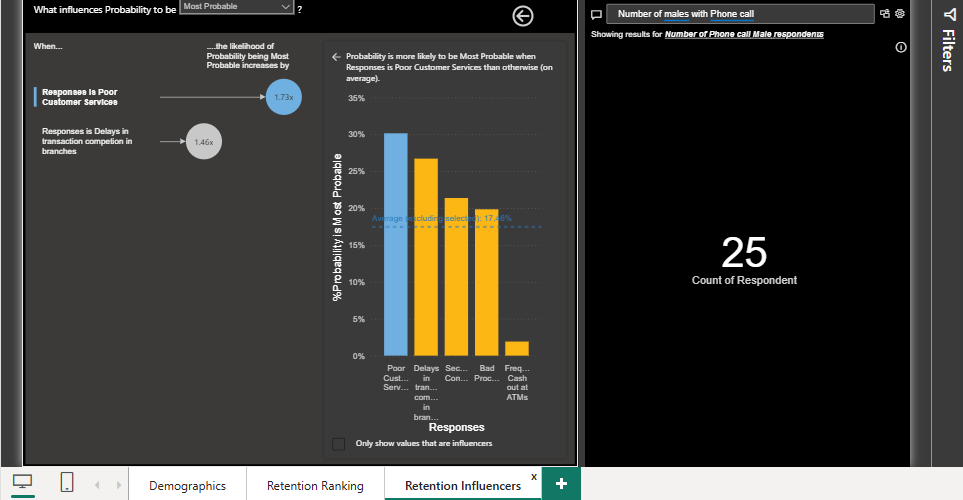
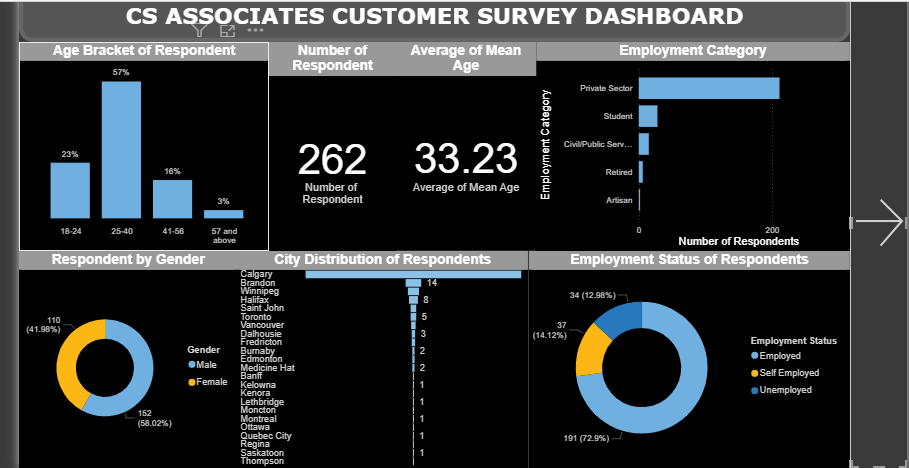
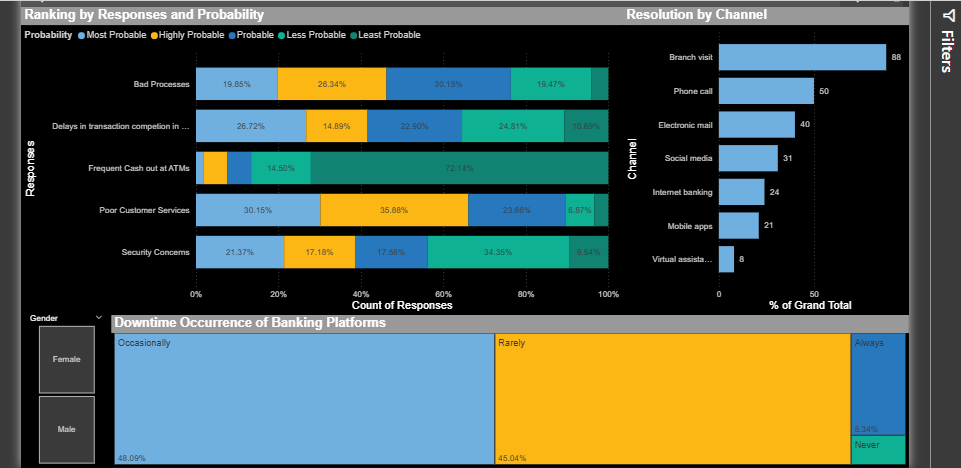

# Customer Service Survey Analysis – Power BI Dashboard

## Overview
Built an interactive Power BI dashboard to analyze customer service survey data from a banking industry study, identifying key drivers of customer churn and providing actionable retention strategies.

## Business Problem
CS Associates needed to move beyond broad demographic trends to uncover **specific pain points** driving customer attrition in the banking sector. The goal was to identify which service issues most strongly predict customer churn and recommend data-driven interventions.

## Dataset
- **Source:** Customer service survey (banking industry)
- **Size:** 262 respondents
- **Key variables:** Demographics (age, gender, employment, location), account balance, service downtime frequency, churn risk factors
- **Note:** Data cleaned in Power BI; statistical analysis conducted in Excel (Data Analysis ToolPak)

## Key Metrics (KPIs)
- **Customer churn probability** by service issue (poor service, transaction delays, security concerns, bad processes)
- **Account balance distribution** (mean, median, outliers)
- **Age demographics** (average: 33 years; 57% aged 25–40)
- **Employment status breakdown** (72.9% employed; majority private sector)
- **Geographic distribution** (Calgary: 192; Brandon: 14; Winnipeg: 8)

## Dashboard Screenshots

## Key Insights
- **Poor customer service** is the #1 churn driver (30.15% ranked "most probable"), followed by **transaction delays** (26.72%) and **security concerns** (21.37%).
- **Weak correlation** (r = 0.39) between age and account balance suggests employment/income factors matter more than age alone.
- **High account balance variability** (mean: $3.17M; median: $30K) indicates outliers—likely high-net-worth clients skewing averages.
- Regression model (R² = 0.262) shows age and downtime frequency explain only 26% of balance variance, signaling other unmeasured factors (e.g., income, tenure) drive wealth.
- **Frequent ATM cash-outs** ranked lowest as a churn factor (only 5 respondents), suggesting digital channel issues are more critical.

## Recommendations
1. **Enhance customer service training** (communication, empathy, problem-solving)
2. **Reduce digital platform downtime** through infrastructure upgrades
3. **Streamline transaction processes** (automation, queue management)
4. **Strengthen security measures** (multi-factor authentication, fraud detection)
5. **Promote digital channels** with awareness campaigns and incentives

## Tools & Skills
- **Power BI:** Data cleaning (Power Query), DAX measures, interactive dashboards
- **Excel:** Descriptive statistics, correlation analysis, regression modeling (Data Analysis ToolPak)
- **Data modeling:** Star schema, relationships
- **Statistical analysis:** Regression, correlation, distribution analysis
- **Business storytelling:** Translating statistical findings into actionable strategies

## How to View
1. Download `customer-service-survey.pbix`
2. Open with **Power BI Desktop** (free download from Microsoft)
3. Interact with slicers to filter by age, gender, employment, or location

## Project Context
Group project completed as part of [Your Program/Course Name]. Collaborated on data cleaning, statistical analysis, and visualization design. Presented findings to stakeholders with actionable retention strategies.

---

**Note:** This project demonstrates end-to-end analytics workflow—from raw survey data to statistical modeling to executive-ready dashboards with business recommendations.
